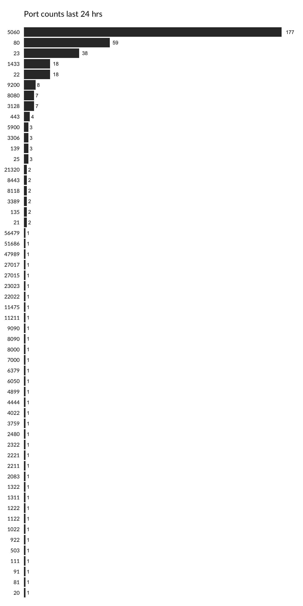

<!-- README.md is generated from README.Rmd. Please edit that file -->


mhn is an R package to interface with the MHN API and (eventually) provide tools to analyze and visualize MHN data.

The API wrapper functions in this package all rely on a MHN server API key residing in the environment variable `MHN_API_KEY` or being passed in as a parameter. The former is useful in simple deplpoyments where there is only one MHN server. In such cases, the easiest way to accomplish this is to set it in the `.Renviron` file in your home directory.

This package pairs nicely with:

-   [iptools](https://github.com/hrbrmstr/iptools)
-   [urltools](https://github.com/Ironholds/urltools)
-   [cymruservices](https://github.com/hrbrmstr/cymruservices)
-   [shodan](https://github.com/hrbrmstr/shodan)
-   [rgeolocate](https://github.com/Ironholds/rgeolocate)
-   [whoisxmlapi](https://github.com/hrbrmstr/whoisxmlapi)
-   [domaintools](https://github.com/hrbrmstr/domaintools)
-   [whoapi](https://github.com/Ironholds/whoapi)

The following functions are implemented:

-   `attacker_stats`: Get attacker (IP) statistics
-   `feed_info`: Get data for a specific hpfeed
-   `hp_feeds`: Getthe raw hpfeeds data collected over a specific channel.
-   `intel_feed`: Get intel feed
-   `ip_metadata`: Get IP metadata (mainly from 'p0f' honeypot data)
-   `mhn_api_key`: Get or set `MHN_API_KEY` value
-   `sensors`: Get sensors.
-   `sessions`: Get normalized sessions/connection data
-   `session_info`: Get data for a specific attack session
-   `top_attackers`: Get top attackers
-   `mhn_dork`: MHN dork *(I have no idea what this is tho)*
-   `mhn_file`: MHN file *(I have no idea what this is tho)*
-   `mhn_url`: MHN url *(I have no idea what this is tho)*

### News

-   Version 0.0.0.9000 released

### Installation

``` r
devtools::install_github("hrbrmstr/mhn")
```

### Usage

``` r
library(mhn)

# current verison
packageVersion("mhn")
#> [1] '0.0.0.9000'

library(dplyr)
#> 
#> Attaching package: 'dplyr'
#> 
#> The following objects are masked from 'package:stats':
#> 
#>     filter, lag
#> 
#> The following objects are masked from 'package:base':
#> 
#>     intersect, setdiff, setequal, union
library(ggthemes)
#> Loading required package: ggplot2
library(scales)

ssns <- sessions(hours_ago=24)$data

port_tots <- count(ssns, destination_port)
```

``` r
gg <- ggplot(port_tots)
gg <- gg + geom_bar(stat="identity",
                    aes(x=reorder(destination_port, n), y=n))
gg <- gg + geom_text(aes(x=reorder(destination_port, n), y=n, label=comma(n)), 
                     hjust=-0.5, size=3)
gg <- gg + scale_x_discrete(expand=c(0,0))
gg <- gg + scale_y_continuous(expand=c(0,0), limits=c(0, extendrange(port_tots$n)[2]))
gg <- gg + coord_flip()
gg <- gg + labs(x=NULL, y=NULL, title="Port counts last 24 hrs\n")
gg <- gg + theme_tufte(base_family="Lato")
gg <- gg + theme(axis.ticks.y=element_blank())
gg <- gg + theme(axis.text.x=element_blank())
gg <- gg + theme(axis.ticks.x=element_blank())
gg <- gg + theme(plot.title=element_text(hjust=0))
gg
```



### Test Results

``` r
library(mhn)
library(testthat)

date()
#> [1] "Sat Aug 22 12:13:33 2015"

test_dir("tests/")
#> testthat results ========================================================================================================
#> OK: 0 SKIPPED: 0 FAILED: 0
#> 
#> DONE
```

### Code of Conduct

Please note that this project is released with a [Contributor Code of Conduct](CONDUCT.md). By participating in this project you agree to abide by its terms.
